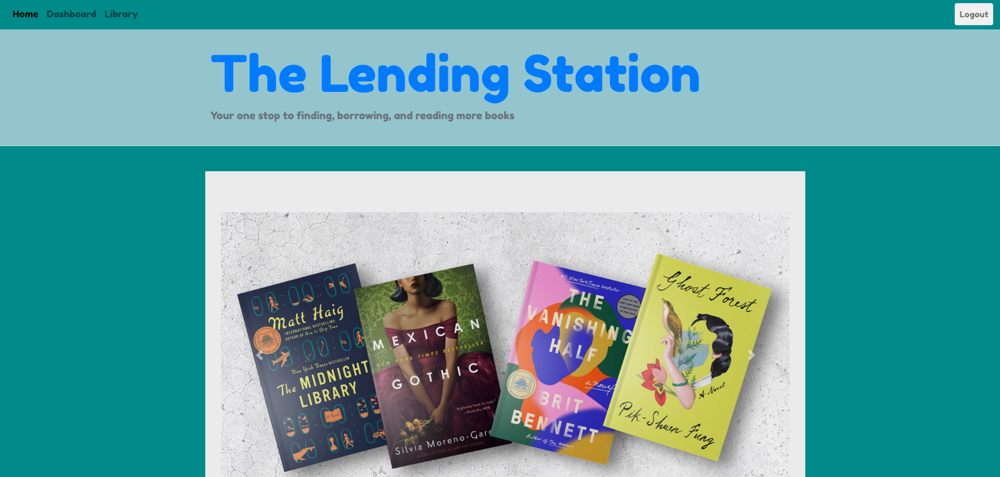

# The Lending Station

## Description

This application is a database for a library that allows librarians to keep track of, add, update, and delete books, users, and reviews from their database. Readers are also able to login to keep track of the book they have, or are currently borrowing. 

The site is easy to navigate, and includes authorization controls to ensure that users must be logged in to use the site, and also that only admins are authorized to access certain pages.

To test out the site as an admin, use "Meer" as the username, and "dasamsam" for the password. To test out the site as a user, use "Pang" as the username, and "thebigpang" for a password. 

## Table of Contents

- [Installation](#installation)
- [Usage](#usage)
- [Credits](#credits)
- [License](#license)
- [Tests](#tests)

## Installation

This application has been deployed onto Heroku and should run without any installation required.

## Usage

This application has been deployed onto Heroku, here is a link to the deployed site:

[The Lending Station](https://the-lending-station.herokuapp.com/)

Here is an image of the deployed application's dashboard on loading:

## Contributors

Here is a list of contributors to this application:

Harmanjot Boparai: https://github.com/HarmanBoparai

Alastair Lee: https://github.com/Honsumal

## License

MIT License

## Tests

N/A

## Questions

Here are two links to reach out to me:

Github: https://github.com/sashdc

Email: saharshdc@gmail.com